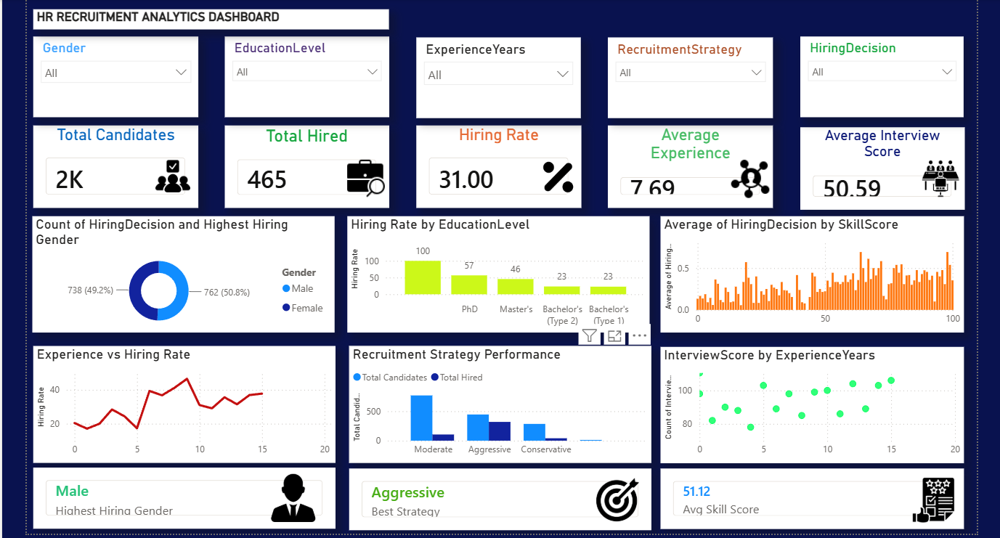

# Recruitment Analytics Dashboard

## Project Overview

This project analyzes recruitment data to evaluate hiring performance and identify factors influencing hiring decisions. Using SQL, Excel, and Power BI, the project transforms raw recruitment data into meaningful insights that support data-driven talent acquisition strategies.

## Project Objectives

* Analyze recruitment and hiring trends.
* Measure key hiring metrics and recruitment performance.
* Evaluate the impact of interview, skill, and personality scores on hiring decisions.
* Identify hiring patterns across education, gender, and experience levels.
* Build an interactive dashboard to support HR decision-making.

## Dataset

The dataset contains **1,500 candidate records** with the following attributes:

* Age
* Gender
* Education Level
* Experience Years
* Previous Companies
* Distance from Company
* Interview Score
* Skill Score
* Personality Score
* Recruitment Strategy
* Hiring Decision

## Tools & Technologies

* SQL (PostgreSQL)
* Microsoft Excel
* Power BI

## Project Workflow

1. Data Collection
2. Data Cleaning and Preprocessing
3. SQL Data Analysis
4. KPI Creation
5. Power BI Dashboard Development
6. Business Insights and Recommendations

## Key Performance Indicators (KPIs)

* Total Candidates
* Total Hired Candidates
* Hiring Rate
* Average Interview Score
* Average Experience
* Average Skill Score

## Dashboard Features

* Recruitment Overview
* Hiring Rate Analysis
* Candidate Demographics
* Interview Performance Analysis
* Recruitment Strategy Analysis
* Experience Analysis
* Interactive Filters and Slicers

## Key Insights

* Recruitment strategy significantly impacts hiring outcomes.
* Higher interview and skill scores are associated with higher hiring rates.
* Candidate experience influences recruitment decisions.
* Dashboard enables quick monitoring of recruitment performance through interactive visualizations.

## Repository Contents

* Recruitment_Analytics.pbix
* SQL_Queries.sql
* recruitment_data.csv
* Recruitment_Analytics_Report.pdf
* Dashboard Screenshots
* README.md

## Dashboard Preview

## Conclusion

This project demonstrates how SQL, Excel, and Power BI can be used together to analyze recruitment data, generate actionable HR insights, and support data-driven hiring decisions.
